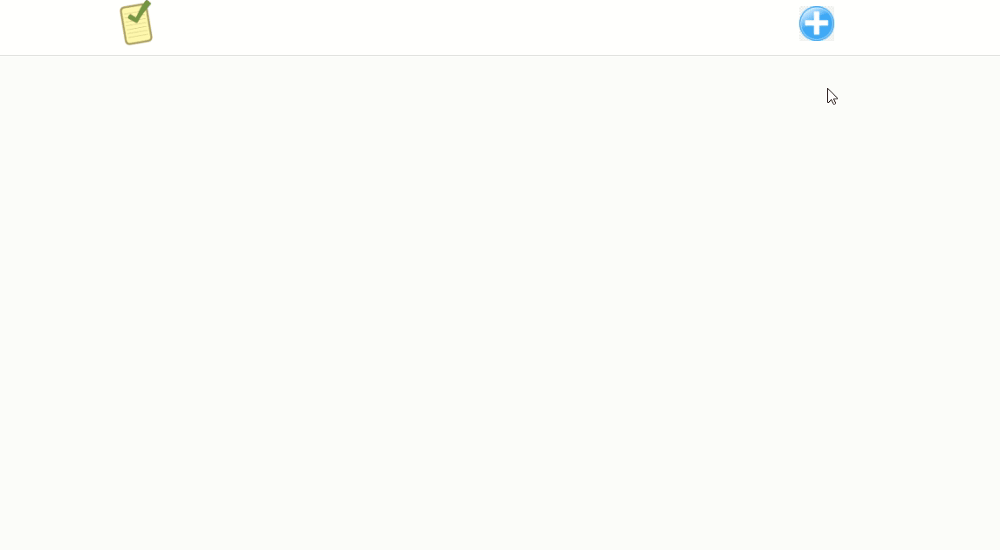

# Todo List

## :rocket: :rocket: Projeto simples para treinar 

# Tecnologias

ReactJS NodeJS MongoDB :purple_heart: :purple_heart: :purple_heart:



## ✋🏻 Pré-requisitos

- [Node.js](https://nodejs.org/en/)
- [Yarn](https://yarnpkg.com/pt-BR/docs/install)
- [mongoDB](https://www.mongodb.com/)
## 🔥 Development setup

Api
```sh
npm install or yarn
npm start or yarn start
```
Frontend
```sh
npm install or yarn
npm start or yarn start
```

## 👨🏼‍💻 Desenvolvido por:

- [Caique Queiroz](https://github.com/clqueiroz)
