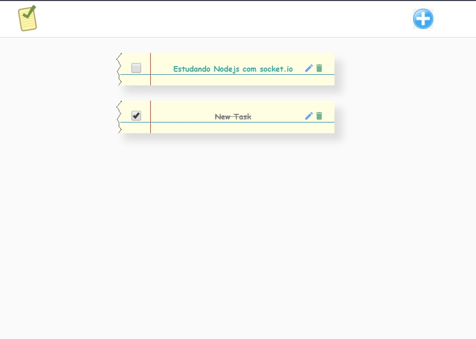

# Todo List

## Projeto simples para treinar

# Tecnologias

ReactJS NodeJS



## Development setup

Api
```sh
npm install or yarn
npm start or yarn start
```
Frontend
```sh
npm install or yarn
npm start or yarn start
```
